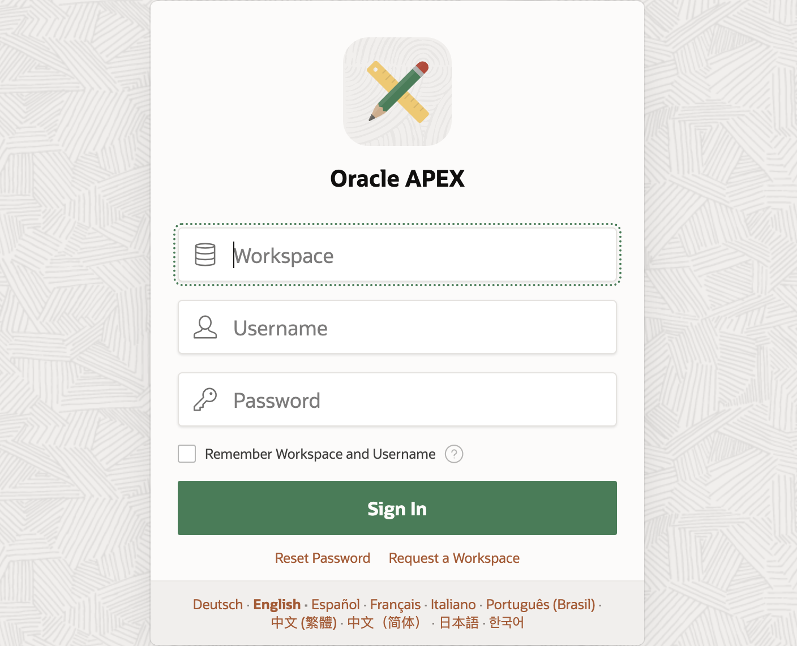
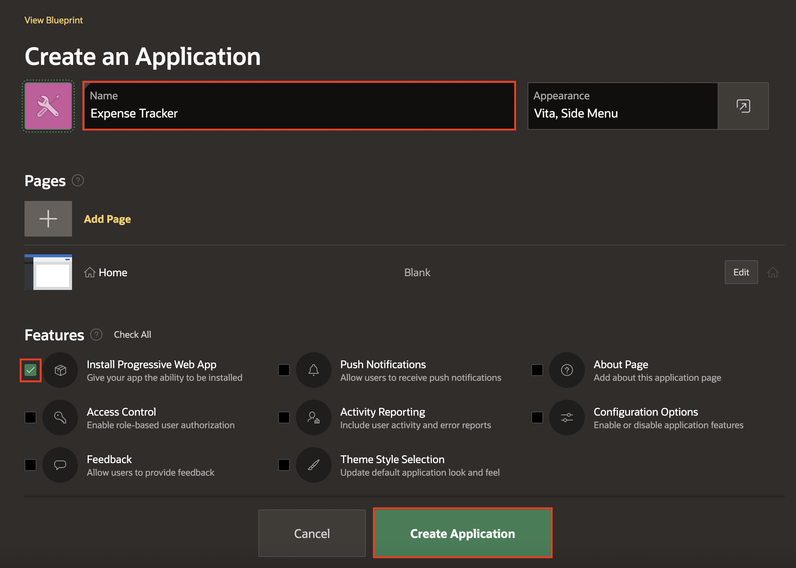
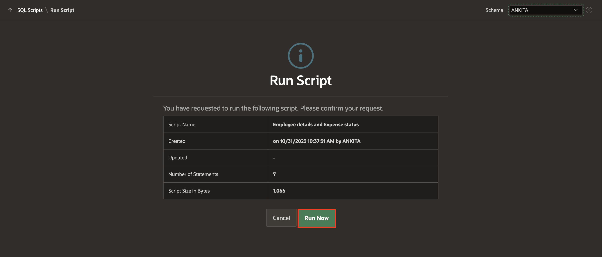
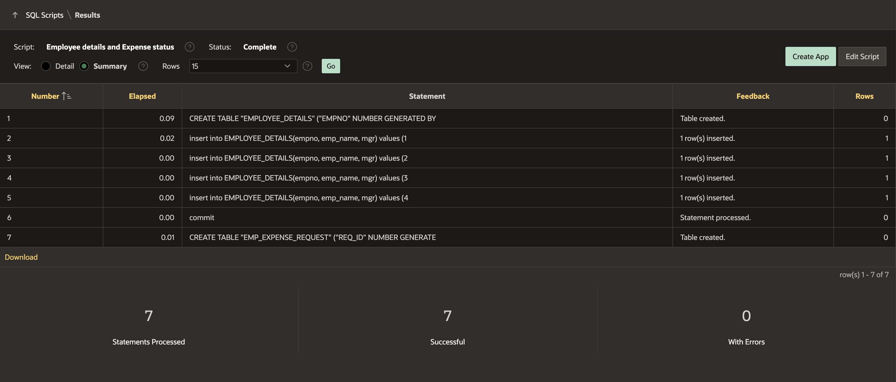

# Create an Expense Tracker Application

## Introduction

In this lab, you learn to create a new APEX Application called Expense Tracker. You create two database tables: **EMPLOYEE\_DETAILS** table that consists of all the employee details; an **EMP\_EXPENSE\_REQUEST** table that is used to store expense report details submitted by an employee. Finally, you also learn to add new users to your APEX application.

Estimated Time: 10 minutes

### Objectives

In this lab, you will:
- Create an APEX Application
- Create and run SQL Script
- Add Users


## Task 1: Create an Application
In this lab, you create a new application named Expense Tracker.

1. If you have not already logged into your Oracle APEX workspace, sign in using the workspace name, email, and password you signed up with.

    

2. At the top left of your workspace, click **App Builder**.

    

3. On the App Builder page, click **Create**.

    

4. Click **New Application**

    

5. In the Create an Application wizard, set Name to **Expense Tracker**.

6. Click **Create Application** to create your app and go to the application home page.

    

## Task 2: Create SQL Script
In this lab, you create database objects using SQL Scripts.

1. At the top of the application home page, click **SQL Workshop** and then **SQL Scripts**. The SQL Scripts page appears.

    

2. Click **Create**. The Script Editor appears.

    

3. In the Script Name, enter a name for the script - **Employee details and Expense status**

4. Enter the SQL statements.

   Copy the code below and paste it into the code editor:

      ```
      <copy>
      CREATE TABLE "EMPLOYEE_DETAILS"
      ("EMPNO" NUMBER GENERATED BY DEFAULT ON NULL
      AS IDENTITY MINVALUE 1 MAXVALUE 9999999999999999999999999999
      INCREMENT BY 1 START WITH 8000 CACHE 20 NOORDER  NOCYCLE  NOKEEP  NOT NULL ENABLE,
      "EMP_NAME" VARCHAR2(100),
      "MGR" NUMBER(4,0),
      CONSTRAINT "EMP_PK" PRIMARY KEY ("EMPNO"));
      insert into EMPLOYEE_DETAILS(empno, emp_name, mgr) values (10, 'JOHN', 20);
      insert into EMPLOYEE_DETAILS(empno, emp_name, mgr) values (20, 'CLARA',30);
      insert into EMPLOYEE_DETAILS(empno, emp_name, mgr) values (30, 'JANE', 40);
      insert into EMPLOYEE_DETAILS(empno, emp_name, mgr) values (40, 'MATT', null);
     commit;
      CREATE TABLE "EMP_EXPENSE_REQUEST"
      ("REQ_ID" NUMBER GENERATED BY DEFAULT ON NULL
      AS IDENTITY MINVALUE 1 MAXVALUE 9999999999999999999999999999
      INCREMENT BY 1 START WITH 8000 CACHE 20 NOORDER NOCYCLE NOKEEP NOT NULL ENABLE,
      "EMP_NO" VARCHAR2(10),
      "EXPENSE_TYPE" VARCHAR2(100),
      "ESTIMATED_COST" NUMBER(8,0),
      "UPDATED_BY" VARCHAR2(100),
      "STATUS" VARCHAR2(20),
      CONSTRAINT "EMP_EXPENSE_REQUEST_PK" PRIMARY KEY ("REQ_ID"));  
      </copy>
      ```

5. Click **Save and Run Now**. Now you can see that SQL statements run successfully.

  

  

  

## Task 3: Add Users
   In this lab, you create users for multi-level management.

1. Navigate to the Administration icon on Application home page and select **Manage Users and Group** from the dropdown list.

     

2. Click **Create Multiple Users**

     

3. Specify the following attributes:

     - List of Email Addresses: **MATT@oracle.com, JANE@oracle.com, CLARA@oracle.com, JOHN@oracle.com**

     - Usernames : Select **Exclude @ domain as part of the username**

     - For password and Confirm Password: Enter a password of your choice

4. Click **Next** and **Create Valid Users**.

   

   

     


## **Summary**
You now know how to create an application, run a SQL script and add users.

You may now **proceed to the next lab**.   

## Acknowledgments
   - **Author** - Ankita Beri, Product Manager
   - **Contributor** - Roopesh Thokala, Senior Product Manager
   - **Last Updated By/Date** - Ankita Beri, Product Manager, June 2023
