# Create a Data Model using Generative AI

## Introduction

In this lab, you learn how to create a Customer Support data model using Generative AI. Ensure you have a secure key for accessing OCI Generative AI, OpenAI or Cohere services. You will then use Generative AI to create a schema that includes customers, accounts, agents, support tickets, ticket timelines, interactions, and SLAs for managing support operations.

Estimated Time: 5 minutes

### Objectives

In this lab, you will:

- Create a Data Model using AI in Oracle APEX Workspace.

### Before You Start

- Sign up and Get access for one of the supported Generative AI Services like OCI Generative AI, OpenAI or Cohere.

- An Oracle Cloud paid account, or free trial.

- An APEX Workspace

## Task 1: Create Customer Support Data Model using AI

To create a data model with AI, ensure that you have configured Generative AI Service and enabled **Used by App Builder** (Refer to the previous Task). If a Generative AI Service is not configured, the Create Data Model Using AI option will not be visible.

In this task, you will learn how to leverage Oracle APEX's Generative AI Service to build a Customer Support Data Model without writing SQL manually. By providing simple prompts, you will generate database objects, refine them, and add sample records automatically.

1. Login to your Application. On the Workspace home page, click **SQL Workshop**.

    

2. Click **Utilities**.

    

3. Click **Create Data Model Using AI**.

    

    

    >**Note:** You can also access Create Data Model Using AI directly from the Tasks list on the SQL Workshop home page.

4. When using Generative AI features within the APEX development environment *for the first time*, you will be asked to provide consent. In the **APEX Assistant** Wizard, if you see a Dialog regarding **consent**. Click on **Accept**.

    

5. You will use the **APEX Assistant** Wizard to create a Customer Support Data Model using AI. To do this, enter the prompts mentioned below. Make sure that you choose **Oracle SQL** for **SQL Format**.

    **Prompt 1:**
    ```
    <copy>
    Create a data model for customer support app for a retail bank with entities for Customers, their Accounts, and the Support Tickets opened for those customers.
    </copy>
    ```

    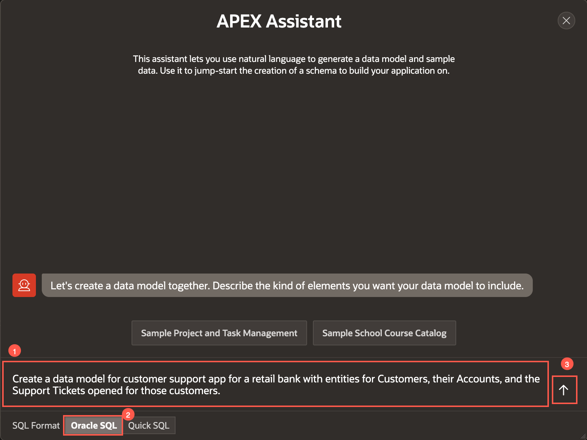

6. Enter another prompt to add supporting entities.

    **Prompt 2:**
    ```
    <copy>
    Add supporting entities for Service Requests, SLA tracking on each support ticket, and the customer channels for support interactions.
    </copy>
    ```

    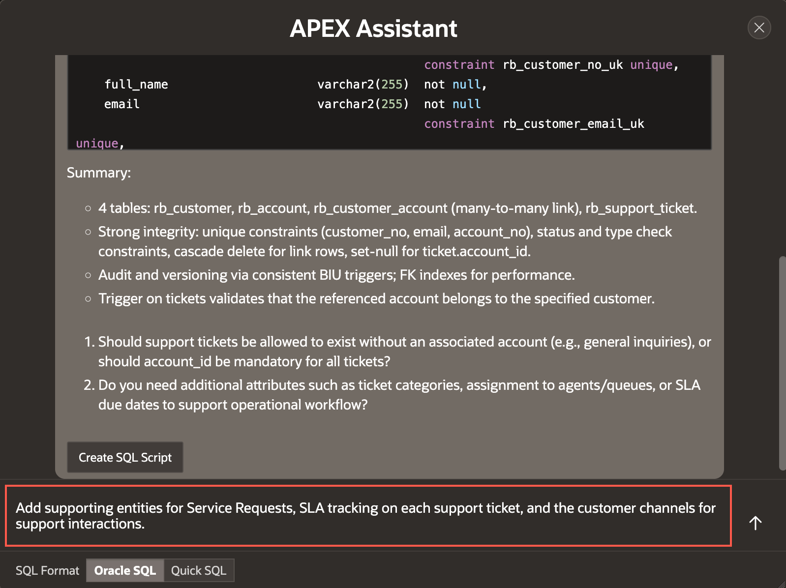

7. The APEX Assistant provides options to select from two types of SQL Formats: Oracle SQL and Quick SQL. Before you provide the next prompt, choose SQL Format as **Quick SQL**. Add a prompt to update prefix of all database objects.

    **Prompt 3:**
    ```
    <copy>
    Prefix all objects with cs_
    </copy>
    ```

    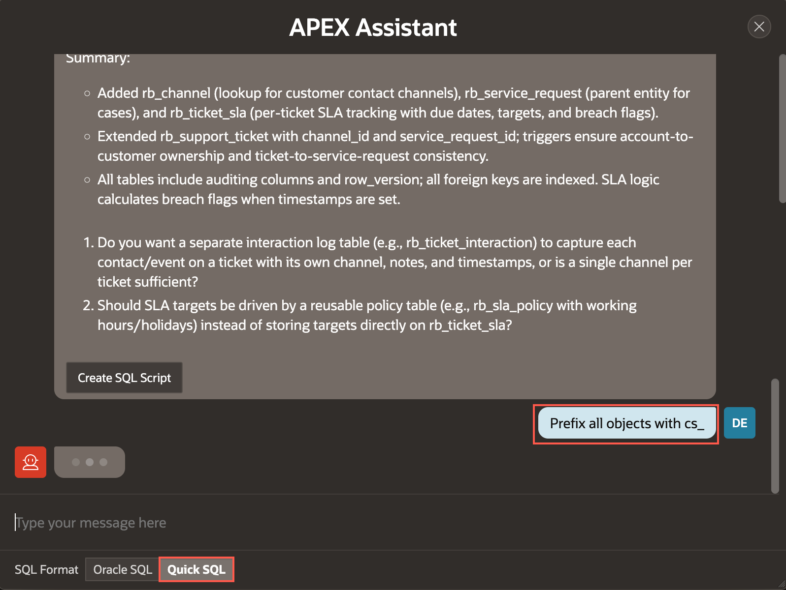

8. At this point, we are satisfied with the generated Quick SQL script. Click **Review Quick SQL**.

    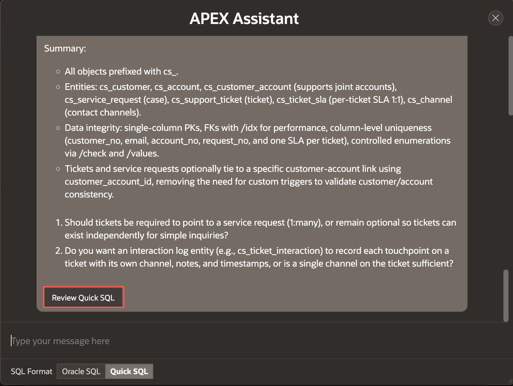

9. In the Quick SQL editor, observe the generated Quick SQL shorthand syntax on the left pane and the corresponding SQL script on the right pane. Click the context menu beside *Review and Run* and select **Save SQL script**.

    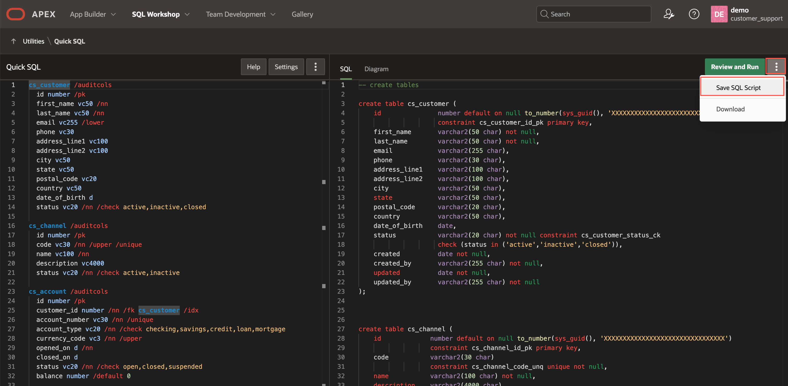

9. For Script Name, enter **Customer Support Data Model**. Click **Save Script**.

    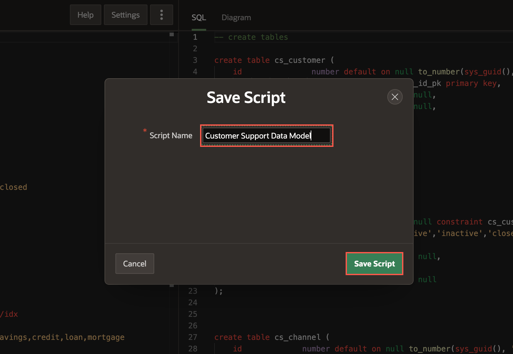

10. Click **Review and Run** to run the SQL script.

    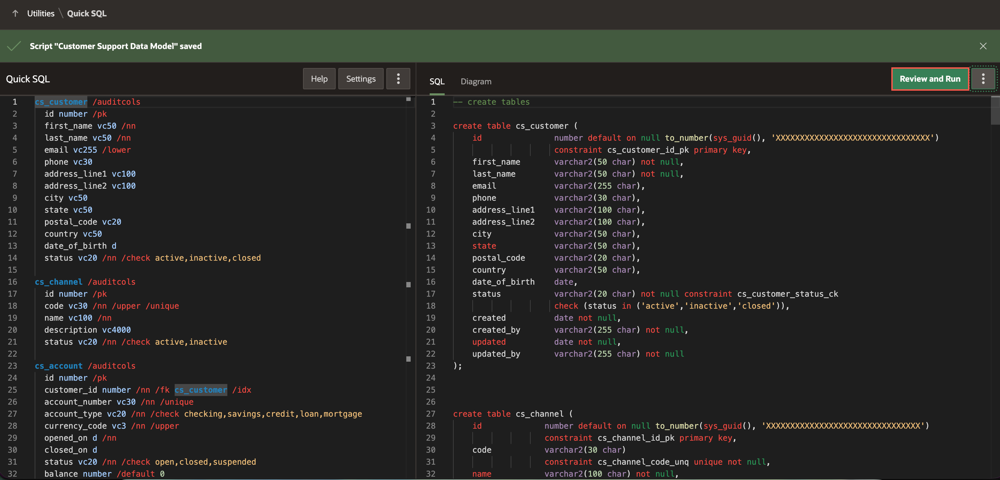

10. At this point, you are in the SQL Scripts editor with the **Customer Support Data model** displayed. Next, we'd like to add sample data into the tables. To do this, we leverage the APEX Assistant in the Code Editor. Click **APEX Assistant**.

    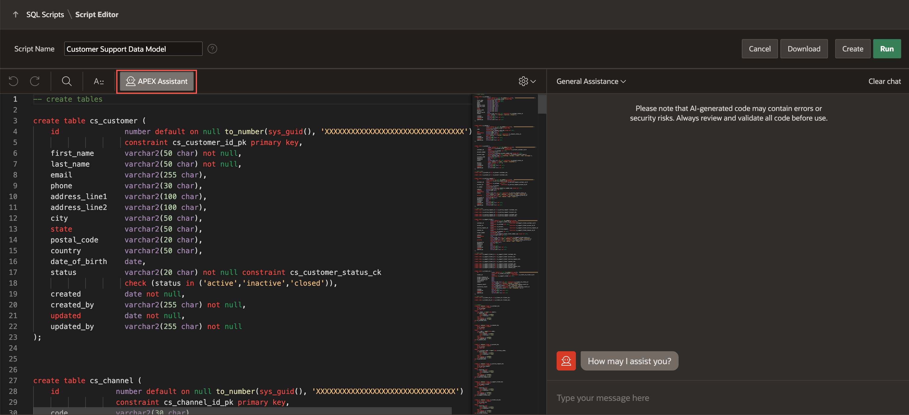

11. Select your SQL code and click **Use Selection** from the APEX Assistant box.

    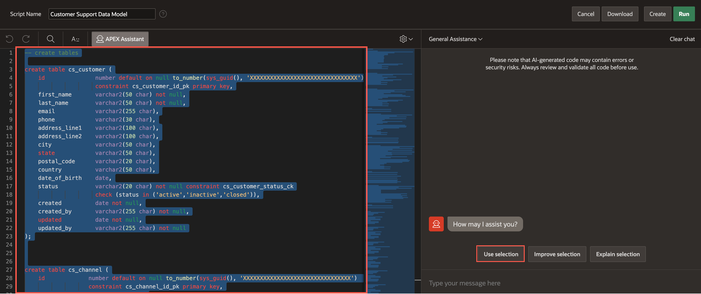

12. In APEX Assistant box, enter the prompt to generate sample data for that tables.

    **Prompt 1:**
    ```
    <copy>
    Generate Sample Data
    </copy>
    ```

    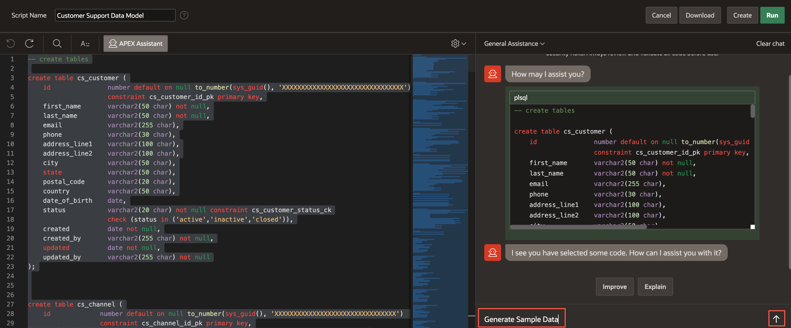

13. **Copy** the generated insert queries from the APEX Assistant box.

    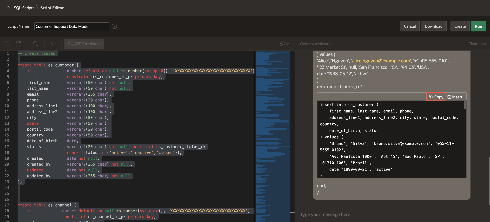

14. Paste the copied queries into the left-hand side code editor towards the end.

    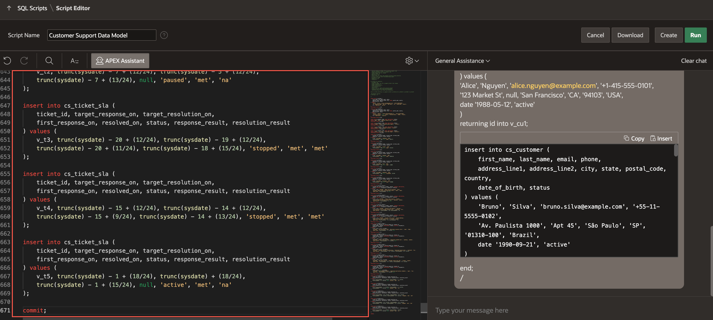

15. At this point, you can optionally replace the generated script with the provided [cs_data_model.sql](files/cs_data_model.sql) to ensure your objects match the reference data model used throughout this workshop. The excerpt below shows the beginning of the script:

    > Note: We are replacing the code to ensure the lab functions as intended. This update is purely to maintain consistency with the lab steps and the expected outcomes.

    ```
    -- ============================================================================
    -- BFSI Customer Support System - Oracle Database DDL
    -- Demo-focused simplified data model
    -- All objects prefixed with CS_ (Customer Support)
    -- ============================================================================

    -- Drop tables if they exist (for clean reinstall)
    -- DROP TABLE cs_sla CASCADE CONSTRAINTS;
    -- DROP TABLE cs_interactions CASCADE CONSTRAINTS;
    -- DROP TABLE cs_ticket_updates CASCADE CONSTRAINTS;
    -- DROP TABLE cs_tickets CASCADE CONSTRAINTS;
    -- DROP TABLE cs_agents CASCADE CONSTRAINTS;
    -- DROP TABLE cs_accounts CASCADE CONSTRAINTS;
    -- DROP TABLE cs_customers CASCADE CONSTRAINTS;

    -- ============================================================================
    -- TABLE: cs_customers
    -- Represents the customer raising a support request
    -- ============================================================================
    CREATE TABLE cs_customers (
        customer_id       NUMBER GENERATED BY DEFAULT ON NULL AS IDENTITY
                          CONSTRAINT cs_customers_id_pk PRIMARY KEY,
        customer_name     VARCHAR2(255 CHAR) NOT NULL,
        customer_type     VARCHAR2(50 CHAR) DEFAULT 'Individual' 
                          CONSTRAINT cs_customers_type_chk 
                          CHECK (customer_type IN ('Individual', 'Corporate')),
        email             VARCHAR2(255 CHAR),
        mobile            VARCHAR2(50 CHAR),
        kyc_status        VARCHAR2(50 CHAR) DEFAULT 'Pending'
                          CONSTRAINT cs_customers_kyc_chk 
                          CHECK (kyc_status IN ('Pending', 'Verified', 'Rejected')),
        created_at        DATE NOT NULL,
        created_by        VARCHAR2(255 CHAR) NOT NULL,
        updated_at        DATE NOT NULL,
        updated_by        VARCHAR2(255 CHAR) NOT NULL
    );

    -- ============================================================================
    -- TABLE: cs_accounts
    -- Provides BFSI context like banking, loans, or cards
    -- ============================================================================
    CREATE TABLE cs_accounts (
        account_id              NUMBER GENERATED BY DEFAULT ON NULL AS IDENTITY
                                CONSTRAINT cs_accounts_id_pk PRIMARY KEY,
        customer_id             NUMBER NOT NULL
                                CONSTRAINT cs_accounts_customer_id_fk
                                REFERENCES cs_customers,
        account_number_masked   VARCHAR2(50 CHAR) NOT NULL,
        account_type            VARCHAR2(50 CHAR) NOT NULL
                                CONSTRAINT cs_accounts_type_chk 
                                CHECK (account_type IN ('Savings', 'Current', 'Loan', 'Credit Card', 'Fixed Deposit')),
        status                  VARCHAR2(50 CHAR) DEFAULT 'Active'
                                CONSTRAINT cs_accounts_status_chk 
                                CHECK (status IN ('Active', 'Inactive', 'Blocked', 'Closed')),
        created_at              DATE NOT NULL,
        created_by              VARCHAR2(255 CHAR) NOT NULL,
        updated_at              DATE NOT NULL,
        updated_by              VARCHAR2(255 CHAR) NOT NULL
    );

    -- Index on customer_id for faster lookups
    CREATE INDEX cs_accounts_i1 ON cs_accounts (customer_id);

    -- <Remaining lines of DDL statements>

    ```

16. After replacing the code, click **Run** in the Script Editor.

    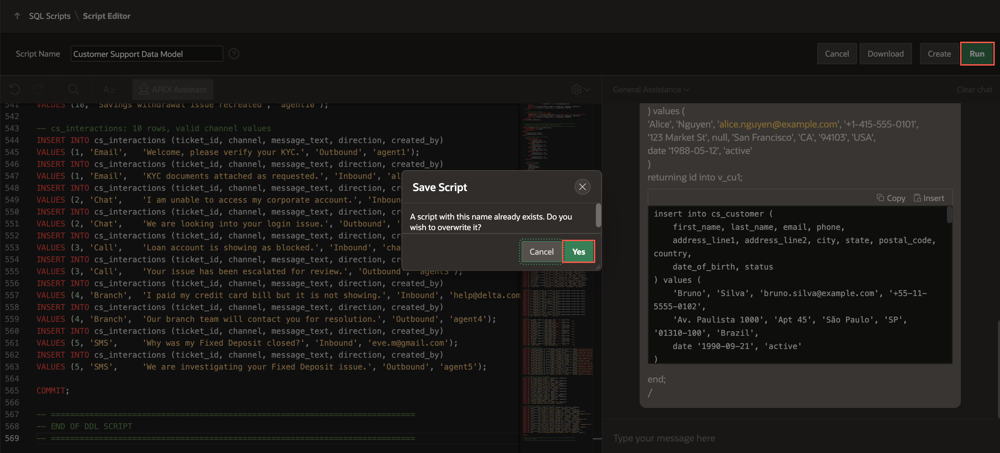

17. Click **Run Now** to submit the script for execution.

    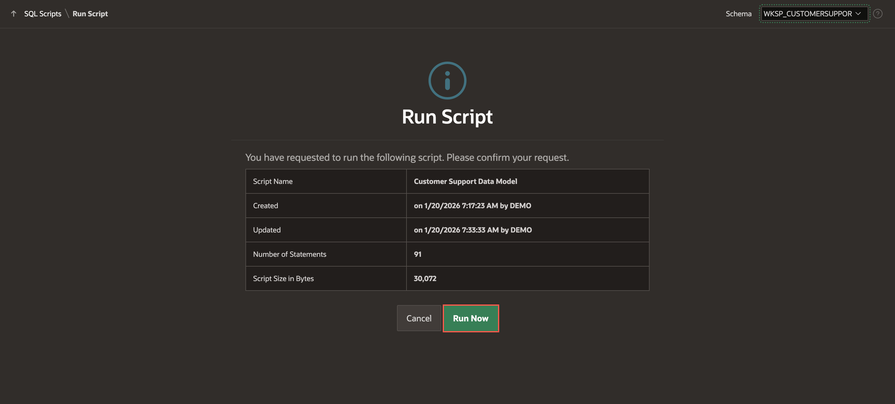

18. The Manage Script Results page appears listing script results.

    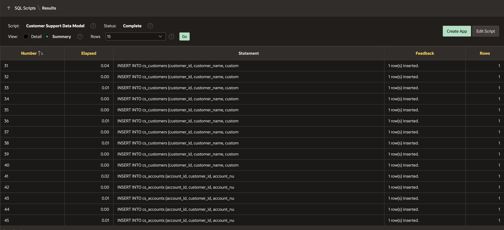

    *Note: Do NOT click Create App yet, since you will be creating an app in the upcoming lab using Generative AI.*

## Task 2: Review Database Objects

Now, let's review the database objects created using AI.

1. Navigate to **SQL Workshop** > **Object Browser**.

    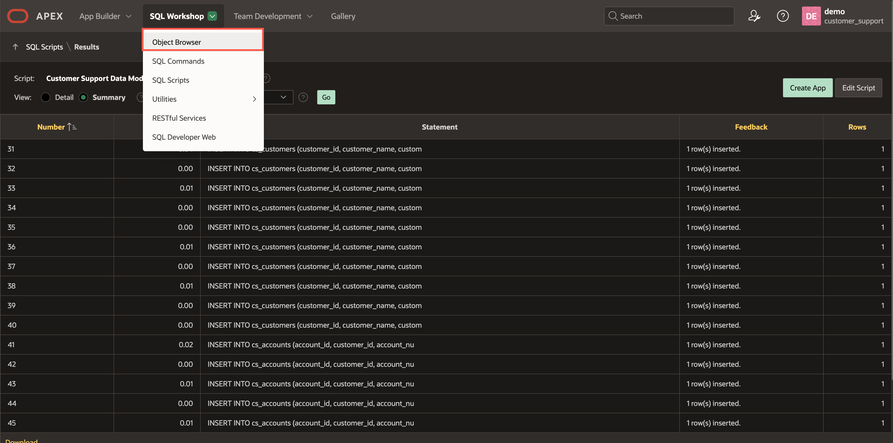

2. Expand **Tables** in the Object Pane to view different tables. Select a table to view table details such as Data, Constraints, and so forth in the Details View pane on the right.

    

## Summary

You now know how to create a Data Model using AI. You may now **proceed to the next lab**.

## Acknowledgments

- **Authors** - Toufiq Mohammed, Principal Product Manager; Apoorva Srinivas, Principal Product Manager
- **Last Updated By/Date** - Apoorva Srinivas, Principal Product Manager, January 2026
